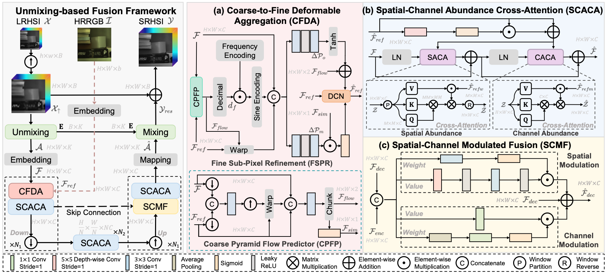

<p align="center">
  <h1 align="center">Enhancing Unregistered Hyperspectral Image Super-Resolution via Unmixing-based Abundance Fusion Learning (Official)</h1>
  
  <p align="center">
    <a href="https://yingkai-zhang.github.io">Yingkai Zhang</a>,  
    <a href="https://scholar.google.com/citations?user=BfbSy4oAAAAJ&hl=zh-CN&oi=ao">Tao Zhang</a>,
    <a href="https://github.com/yingkai-zhang/UAFL/">Jing Nie</a>,
    <a href="https://ying-fu.github.io/">Ying Fu</a>*.
      (*Corresponding author)
  </p>
  <h2 align="center">CVPR 2026</h2>

  <h3 align="center">
    <a href="https://github.com/yingkai-zhang/UAFL/" target='_blank'></a>
    <!-- <a href="https://link.springer.com/article/10.1007/s11263-025-02466-8" target='_blank'></a> -->
    <a href="https://openaccess.thecvf.com/content/CVPR2026/html/Zhang_Enhancing_Unregistered_Hyperspectral_Image_Super-Resolution_via_Unmixing-based_Abundance_Fusion_Learning_CVPR_2026_paper.html" target='_blank'></a>
    <a href="https://arxiv.org/abs/2603.07918" target='_blank'></a>
  </h3>

</p>

This repository contains the official PyTorch implementation of "*Enhancing Unregistered Hyperspectral Image Super-Resolution via Unmixing-based Abundance Fusion Learning*" accepted at **IEEE/CVF Conference on Computer Vision and Pattern Recognition (CVPR) 2026.**

## News :sparkles:

- [x] 2026-07-04: Release code and example checkpoints.
- [x] 2026-06-07: Published online [CVPR](https://openaccess.thecvf.com/content/CVPR2026/html/Zhang_Enhancing_Unregistered_Hyperspectral_Image_Super-Resolution_via_Unmixing-based_Abundance_Fusion_Learning_CVPR_2026_paper.html).
- [x] 2026-03-09: Upload for [Arxiv](https://arxiv.org/abs/2603.07918).

## Overview

Unregistered hyperspectral image super-resolution (HSI SR) aims to recover a
high-resolution HSI from a low-resolution HSI with an unregistered
high-resolution RGB reference. Direct spatial-spectral fusion is sensitive to
misregistration, and explicit pre-alignment may introduce texture distortion.

UAFL addresses this problem with an unmixing-based fusion framework. It first
uses SVD-based spectral unmixing to decouple the upsampled LR HSI into
endmembers and abundance maps. The network then learns residual abundance maps
with unregistered RGB guidance and reconstructs the HR HSI by mixing the learned
abundance residual with the HSI endmembers.

<div align="center">
  
</div>

The main components are:

1. **Unmixing-based fusion framework**: decouples spatial and spectral
   information, reducing the burden of learning from unregistered
   spatial-spectral data.
2. **Coarse-to-Fine Deformable Aggregation (CFDA)**: estimates a coarse flow and
   similarity map, then refines sub-pixel offsets for robust reference feature
   aggregation.
3. **Spatial-Channel Abundance Cross-Attention (SCACA)**: refines abundance
   features with spatial and channel cross-attention guided by aggregated RGB
   reference features.
4. **Spatial-Channel Modulated Fusion (SCMF)**: dynamically merges
   encoder-decoder features with spatial and channel gating weights.


## Setting

### 1. Clone the Repository

```shell
git clone https://github.com/yingkai-zhang/UAFL.git
cd UAFL
```

### 2. Create the Environment

Install dependencies with `create_env.sh` or run the commands manually:

```shell
conda create -n torch1.10 python=3.7
conda activate torch1.10
conda install pytorch torchvision torchaudio cudatoolkit=11.3 -c pytorch
conda install -c conda-forge opencv
pip install -r requirements.txt
```

Some packages, such as `mmcv_full`, `mmflow`, `cupy`, and `torch_dwconv`, are
CUDA-version sensitive. Please install versions compatible with your PyTorch and
CUDA environment if the default `requirements.txt` cannot be installed directly.

### 3. Prepare Data

The experiments use:

- ICVL simulated dataset: [ICVL hyperspectral dataset](https://icvl.cs.bgu.ac.il/pages/researches/hyperspectral-imaging.html)
- REAL unregistered dataset: released with [HSI-RefSR](https://github.com/Zeqiang-Lai/HSI-RefSR)

The data loader expects the following structure, controlled by the config fields
`root`, `input`, `ref`, and `names_path`:

```text
data/
  <dataset>/
    <input>_hsi/
      HR/
        <name>.mat
    <ref>_cmatch/
      HR/
        <name>.png
    train.txt
    test.txt
```

The default `.mat` key is `gt`. The LR HSI is generated on the fly by the
degradation module according to the scale factor in the config.

## Training

Prepare a config file under the corresponding experiment directory. For example,
train UAFL on the REAL dataset at scale factor x4 with:

```shell
python run.py train -s results/refsr/real/sf4/UAFL -c results/refsr/real/sf4/UAFL/config.yaml
```

For the settings reported in the paper, UAFL is trained with AdamW, an initial
learning rate of `1e-5`, weight decay of `5e-5`, batch size 1, and Smooth L1
loss. The paper uses 150 epochs on ICVL and 300 epochs on REAL.

## Inference and Evaluation

Evaluate a trained checkpoint with:

```shell
python run.py test -s results/refsr/real/sf4/UAFL -r best
```

The evaluation reports PSNR, SSIM, and SAM. The module also logs bicubic/SR
input metrics for reference.

The example checkpoint and config can be downloaded [Here](https://drive.google.com/drive/folders/19kvaEk97Jgp1svpPBsqD0U7GKVJGgiBb?usp=sharing) and put into `results/refsr/real/sf4/Ours/ckpt` and `results/refsr/real/sf4/Ours`.

## Baselines and Code Resources

The following table summarizes the comparison methods used in the paper.

| Category | Method | Venue | Year | Public code |
| --- | --- | --- | ---: | --- |
| Single HSI SR | SSPSR | IEEE TCI | 2020 | [GitHub](https://github.com/junjun-jiang/SSPSR) |
| Single HSI SR | MCNet | Remote Sensing | 2020 | [GitHub](https://github.com/qianngli/MCNet) |
| Single HSI SR | BiQRNN | IEEE J-STARS | 2021 | [GitHub](https://github.com/zhiyuan0112/Bi-3DQRNN) |
| Single HSI SR | ESSA | ICCV | 2023 | [GitHub](https://github.com/Rexzhan/ESSAformer) |
| Reference HSI SR | Optimized RGB Guidance | CVPR | 2019 | [GitHub](https://github.com/ColinTaoZhang/HSI-SR) |
| Reference HSI SR | NonRegSRNet | IEEE TGRS | 2022 | [GitHub](https://github.com/saber-zero/NonRegSRNet) |
| Reference HSI SR | MoE-PNP | IEEE TNNLS | 2024 | [GitHub](https://github.com/Jiahuiqu/MoE-PNP) |
| Reference HSI SR | HSIFN | IEEE TNNLS | 2024 | [GitHub](https://github.com/Zeqiang-Lai/HSI-RefSR) |
| Reference HSI SR | LRTN | IJCV | 2025 | [GitHub](https://github.com/YuanyeLiu/Low-Rank-Transformer-For-High-Resolution-Hyperspectral-Computational-Imaging) |
| Reference HSI SR | SRLF | CVPR | 2025 | [GitHub](https://github.com/YuanyeLiu/SRLF-Net) |
| Reference HSI SR | SSCH | IJCV | 2025 | [GitHub](https://github.com/yingkai-zhang/SSC-HSR) |
| Reference HSI SR | UAFL (Ours) | CVPR | 2026 | [GitHub](https://github.com/yingkai-zhang/UAFL) |


## Citation

If you find our work useful for your research, please consider citing the following paper

```bibtex
@inproceedings{zhang2026enhancing,
  title={Enhancing Unregistered Hyperspectral Image Super-Resolution via Unmixing-based Abundance Fusion Learning},
  author={Zhang, Yingkai and Zhang, Tao and Nie, Jing and Fu, Ying},
  booktitle={Proceedings of the IEEE/CVF Conference on Computer Vision and Pattern Recognition},
  pages={41573--41583},
  year={2026}
}
```

## Acknowledgments

This codebase builds on the training framework and baseline implementations used
in related projects, including
[HSI-RefSR](https://github.com/Zeqiang-Lai/HSI-RefSR),
[SSC-HSR](https://github.com/yingkai-zhang/SSC-HSR), [MPI-Flow](https://github.com/Sharpiless/MPI-Flow), and
[SPECAT](https://github.com/THU-luvision/SPECAT). We thank the authors for their
valuable contributions.